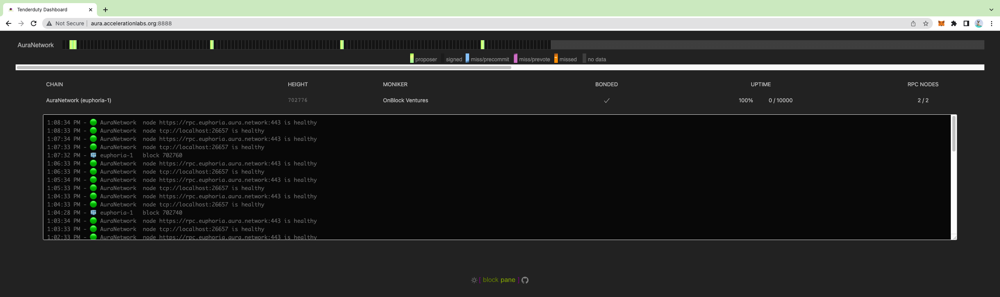

# Install TenderDuty v2 to monitor Aura Network nodes

[](https://pkg.go.dev/github.com/blockpane/tenderduty)
[](https://github.com/blockpane/tenderduty/actions?query=workflow%3AGosec)
[](https://github.com/blockpane/tenderduty/actions?query=workflow%3ACodeQL)

Tenderduty is a comprehensive monitoring tool for Tendermint chains. Its primary function is to alert a validator if they are missing blocks, and has many other features.

v2 is complete rewrite of the original tenderduty graciously sponsored by the [Osmosis Grants Program](https://grants.osmosis.zone/). This new version adds a web dashboard, prometheus exporter, telegram and discord notifications, multi-chain support, more granular alerting, and more types of alerts.

## Install Docker
```
curl -fsSL https://get.docker.com | sh
```

## Configure TenderDuty
```
mkdir tenderduty && cd tenderduty
docker run --rm ghcr.io/blockpane/tenderduty:latest -example-config >config.yml
# edit config.yml and add chains, notification methods etc.
vim config.yml
```
Refer my `config.yml` example file for Aura Network


## Run TenderDuty
```
docker run -d --name tenderduty --network="host" --restart unless-stopped -v $(pwd)/config.yml:/var/lib/tenderduty/config.yml ghcr.io/blockpane/tenderduty:latest
docker logs -f --tail 20 tenderduty
```

## TenderDuty Dashboard
Your dashboard will be public at **http://YOUR_SERVER_IP:8888**\
For instance, my dashboard is http://aura.accelerationlabs.org:8888


## Public RPCs
```
https://rpc.euphoria.aura.network:443
https://snapshot-1.euphoria.aura.network:443
https://snapshot-2.euphoria.aura.network:443
```
